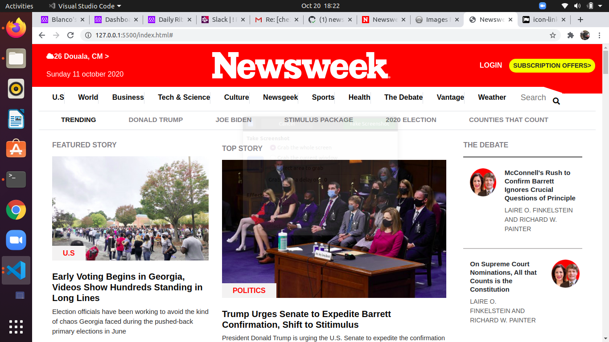

# Newsweek-clone
A clone of the newsweek magazine for microverse
# The next web

# A responsive web design based on The newsweek website made for learning purposes.
## The purpose of the project is to test microverse students mastery of the bootsrap framework and ensure they build responsive webpages across the following viewports. Large screens(laptots) medium screens(tablets) and small screens(Some some smart phones)

## Built With

- HTML & CSS

## Getting started
    In order to run the project locally  clone the repository and open the index.html file in your preferred browser.

## Live Demo

[Live Demo Link](https://che30.github.io/Newsweek-clone/)

## Author
**Che Blanchard**

- GitHub: [@che30](https://github.com/che30)
- LinkedIn: [Che Blanchard](https://www.linkedin.com/in/che-nsoh-9455271b0/)

## Acknowledgements

**Che Blanchard**

- GitHub: [@che30](https://github.com/che30)
- LinkedIn: [Che Blanchard](https://www.linkedin.com/in/che-nsoh-9455271b0/)

## Acknowledgements
- The next web
- W3 schools
- Font awesome
- Stack overflow
- Myself CHE NSOH BLANCHARD

##  Contributing

Contributions, issues, and feature requests are welcome!

## Show your support

Give a ⭐️ if you like this project!

## License

This project is [MIT](./LICENSE.txt) licensed.